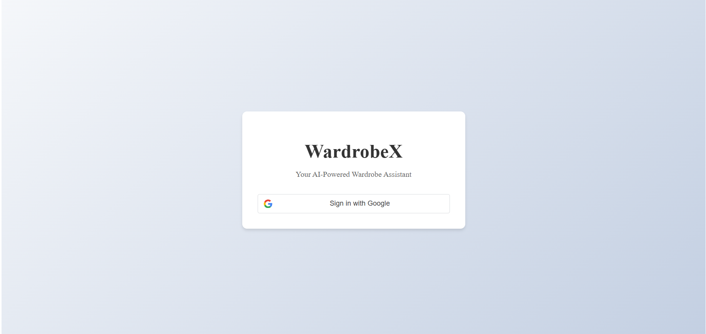
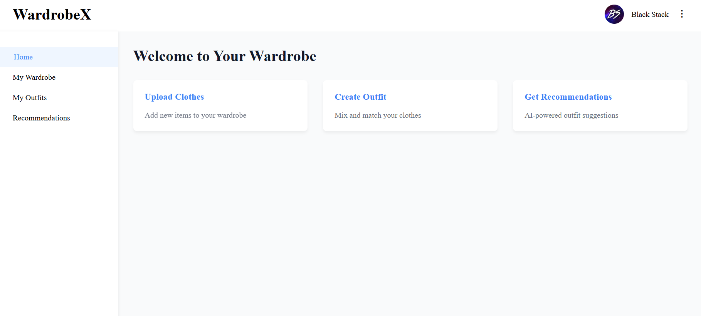
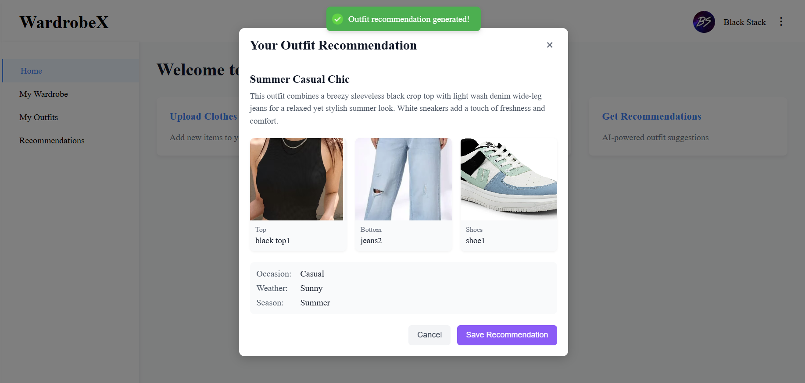

# Virtual AI Wardrobe

Virtual AI Wardrobe is a smart web application that lets users upload 2D clothing images, automatically tag them, and offers AI-driven outfit recommendations based on occasion, mood, time of day, and more, including support for custom prompts. Users can also sign up and maintain personal wardrobes through a secure authentication system.

## Features
- 📷 Upload 2D images of clothing items
- 🏷️ Automatic clothes tagging
- 🤖 Smart outfit recommendation engine
- ❓ Suggestion feature asking for occasion, mood, etc.
- 🔐 User authentication system (Login/Signup)

## Screenshots

### 🔐 Login Page


### 🏠 Home Page (Wardrobe View)


### 👗 AI-Based Recommendation Output


## Tech Stack
- **Framework:** Next.js
- **Frontend:** React, CSS Modules
- **Backend:** Node.js (via Next.js API routes)
- **Database:** PostgreSQL (via Prisma)
- **Authentication:** Google OAuth (via NextAuth.js)
- **AI/ML Integration:** Gemini API

## Getting Started

### Prerequisites
- Node.js
- Git

### Environment Configuration
Before running the project, configure the environment variables in:
- `.env`
- `.env.local`

Required variables include:
- PostgreSQL connection string
- Gemini API key
- Google OAuth client ID and secret

### Installation
1. Clone the repository:
```bash
git clone https://github.com/blackstack-kun/WardrobeX.git
cd WardrobeX
```

2. Install dependencies:
```bash
npm install
```

3. Generate Prisma client:
```bash
npx prisma generate
```

4. Push database schema:
```bash
npx prisma db push
```

5. Run the development server:
```bash
npm run dev
```

## Folder Structure
```
virtual-ai-wardrobe/
├── components/             # Reusable UI components
├── lib/                    # Helper libraries (e.g., auth, db)
├── pages/                  # Next.js routes and API
├── prisma/                 # Prisma schema and migration files
├── public/uploads/         # Uploaded clothing images
├── styles/                 # CSS modules
├── utils/                  # Utility functions
├── .env                    # Server environment variables
├── .env.local              # Frontend/local environment variables
├── LICENSE
├── main                    # Entry point script or config
├── next-env.d.ts
├── outfit_creator_content.txt
├── package-lock.json
├── package.json
├── roadmap.md
├── tsconfig.json
└── README.md
```

## Contributing
Pull requests are welcome. For major changes, please open an issue first to discuss what you would like to change.

## License
[MIT](LICENSE)


